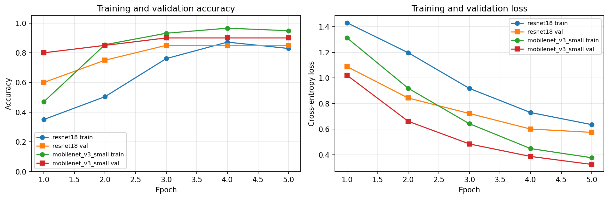
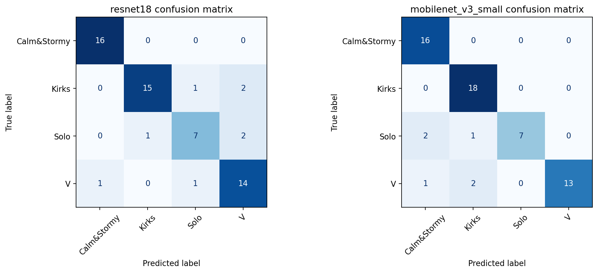
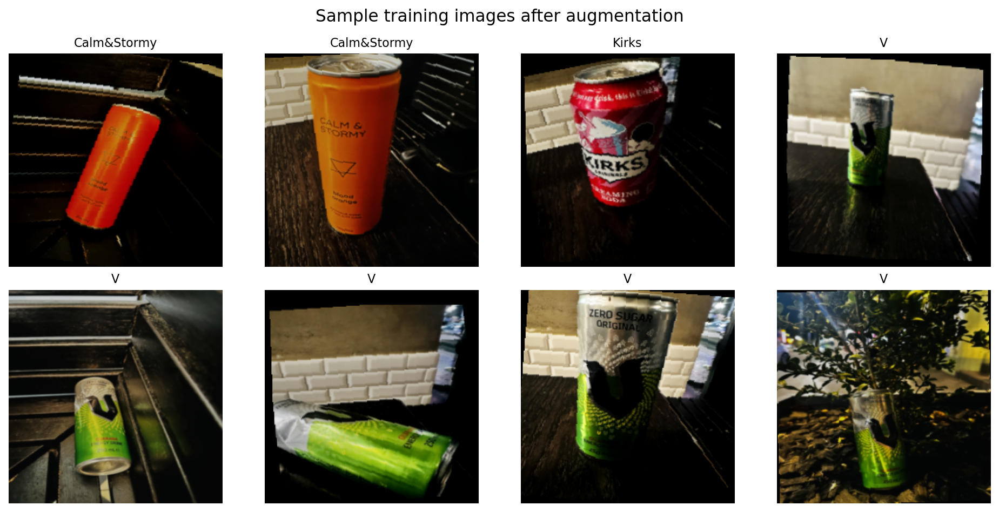

# Fine-Grained Beverage Can Classification for ROS2 Robot Perception

This project builds a fine-grained image classifier for beverage cans and connects it to a ROS2 robot perception pipeline. The system classifies exact product categories, not just "can vs not-can", then uses the prediction stream for scan and target-search robot behaviours.

The repository is cleaned for GitHub/portfolio review: source code is extracted from the Phase 3 submission, reports and notebooks are preserved, generated build folders are removed, and datasets/checkpoints are represented with reproducible commands instead of heavy Git files.

## Highlights

- Custom fine-grained beverage-can dataset across 20 classes.
- Transfer learning with PyTorch and ImageNet-pretrained CNNs.
- MobileNetV3-Large deployment model chosen for accuracy/speed balance.
- OpenCV region-of-interest extraction for can-like crops.
- Robot-camera fine-tuning for blur, reflection, viewpoint, and background shift.
- ROS2 nodes for camera-only classification, scan mode, and target-search behaviour.

## Results

| Stage | Scope | Best model | Key result |
| --- | --- | --- | --- |
| Phase 1-2 | Individual 4-class subset: `Calm&Stormy`, `Kirks`, `Solo`, `V` | MobileNetV3-Small | 90.00% test accuracy, macro F1 0.889 |
| Phase 2 | Fine-tuned 4-class subset | MobileNetV2 / ResNet50 variants | Best runs reached 100% test accuracy on the held-out split |
| Final group model | 20 beverage-can classes | MobileNetV3-Large | 97.20% accuracy, macro F1 0.9617 on 1,927 test images |
| Robot deployment subset | Target-search classes | MobileNetV3-Large | 100% accuracy on the 3-class deployment evaluation |

The submitted reports are in [docs/reports](docs/reports), and extracted text versions are in [docs/extracted-text](docs/extracted-text).

## Visual Results

### Training Curves



### Confusion Matrices



### Sample Training Images



## Repository Layout

```text
.
├── train_all_classes.py          # Train 20-class MobileNetV3-Large baseline
├── train_robot_finetune.py       # Fine-tune all-class model on robot-camera data
├── train_three_classes.py        # Build final 3-class deployment model
├── prepare_robot_dataset.py      # Split robot-captured images
├── evaluate.py                   # Evaluate one checkpoint
├── evaluate_before_after.py      # Compare before/after robot fine-tuning
├── webcam_test_all_classes.py    # Local webcam inference test
├── utils/                        # Dataset, model, metrics, inference helpers
├── ros2_nodes/                   # ROS2 camera and action nodes
├── ros2_ws_setup/                # ROS2 package templates
├── notebooks/                    # Phase notebooks
├── docs/                         # Reports, extracted text, result artifacts
├── data/                         # Local-only dataset placeholders
└── outputs/                      # Local-only generated models/plots/logs
```

## Setup

```bash
python3 -m venv .venv
source .venv/bin/activate
pip install -r requirements.txt
```

For ROS2 deployment, install ROS2 Humble and system packages on Ubuntu:

```bash
sudo apt install ros-humble-cv-bridge python3-rclpy
```

## Training Pipeline

Place the 20-class clean dataset in `data/raw/clean_dataset`, with one folder per class.

```bash
python train_all_classes.py \
  --data-dir data/raw/clean_dataset \
  --split-dir data/processed/clean_dataset_split \
  --epochs 20 \
  --batch-size 16
```

Place robot-camera images in `data/robot_captured`, then split them:

```bash
python prepare_robot_dataset.py \
  --source-dir data/robot_captured \
  --output-dir data/robot_split
```

Evaluate the clean-data model on robot images:

```bash
python evaluate.py \
  --data-dir data/robot_split/test \
  --model-path outputs/models/all_class_model.pth \
  --tag before_robot_finetune
```

Fine-tune the all-class model on robot images:

```bash
python train_robot_finetune.py \
  --data-dir data/robot_split \
  --base-model outputs/models/all_class_model.pth \
  --epochs 20
```

Compare before and after fine-tuning:

```bash
python evaluate_before_after.py \
  --test-dir data/robot_split/test \
  --before-model outputs/models/all_class_model.pth \
  --after-model outputs/models/robot_finetuned_model.pth
```

Train the final deployment subset:

```bash
python train_three_classes.py \
  --robot-dir data/robot_split \
  --output-dir data/processed/three_class_robot \
  --base-model outputs/models/robot_finetuned_model.pth \
  --epochs 15
```

The deployment classes used by the code are:

- `Cocacola_classic`
- `Sprite`
- `Redbull_Classic`

## Webcam Test

```bash
python webcam_test_all_classes.py \
  --model-path outputs/models/three_class_robot_model.pth \
  --class-map outputs/models/three_class_class_to_idx.json
```

Keys: `q` quits, `s` saves a frame, `+` and `-` adjust confidence threshold, and `d` toggles debug view.

## ROS2 Deployment

Copy the ROS2 nodes, model, and class map to the robot workspace, then build:

```bash
mkdir -p ~/comp8430_phase3/src
cd ~/comp8430_phase3/src
ros2 pkg create robot_classifier --build-type ament_python --dependencies rclpy
```

Copy `ros2_nodes/*.py` into the package module, and use the templates in `ros2_ws_setup/` for `setup.py` and `package.xml`.

Build and run:

```bash
cd ~/comp8430_phase3
colcon build
source install/setup.bash
ros2 run robot_classifier robot_demo \
  --model-path /path/to/three_class_robot_model.pth \
  --class-map /path/to/three_class_class_to_idx.json \
  --mode target \
  --target-class Cocacola_classic
```

## Reports and Notebooks

- [Project proposal](docs/reports/project-proposal.pdf)
- [Phase 3 robot fine-tuning report](docs/reports/phase3-robot-finetuning-report.pdf)
- [Final project report](docs/reports/final-project-report.pdf)
- [Phase 1-2 notebook](notebooks/phase1_2_transfer_learning.ipynb)
- [Phase 2 notebook](notebooks/phase2_finetuning.ipynb)
- [Phase 3 notebook](notebooks/phase3_robot_training_evaluation.ipynb)
## My Contribution

As part of this COMP8430 group project, I contributed to dataset collection and preparation, model training and evaluation, result analysis, report writing, and packaging the final project into a clean GitHub portfolio repository. I also helped connect the computer vision model workflow with the ROS2 robot perception/deployment pipeline.

## Notes for Reviewers

This was developed as a COMP8430 group project. Joya Akter contributed to dataset collection/preparation and report work, and this repository packages the full project narrative, reproducible code, and submitted evidence into a clean GitHub format for interview review.
